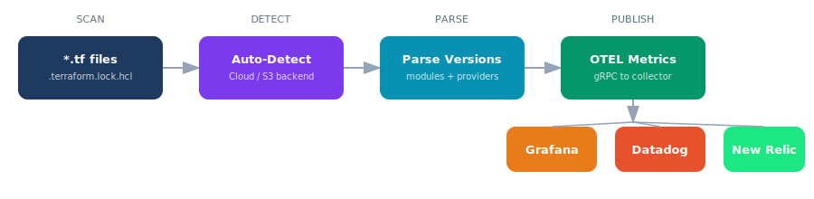

<p align="center">
  
</p>

<p align="center">
  <a href="https://github.com/CloudPulse-HQ/tfwatch/actions/workflows/ci.yml"></a>
  <a href="https://github.com/CloudPulse-HQ/tfwatch/actions/workflows/release.yml"></a>
  <a href="https://opensource.org/licenses/MIT"></a>
  <a href="https://go.dev/"></a>
  <a href="https://www.terraform.io/"></a>
  <a href="https://opentelemetry.io/"></a>
</p>

<p align="center">
  <a href="https://cloudpulse-hq.github.io/tfwatch/"><strong>Website</strong></a> &bull;
  <a href="#quick-start"><strong>Quick Start</strong></a> &bull;
  <a href="#dashboard"><strong>Dashboard</strong></a> &bull;
  <a href="#documentation"><strong>Docs</strong></a> &bull;
  <a href="CONTRIBUTING.md"><strong>Contributing</strong></a>
</p>

---

A single-binary, zero-config tool that tracks Terraform dependencies and publishes them in OTel metric format.

## Why tfwatch?

A critical vulnerability is found in `terraform-aws-modules/vpc/aws` v5.0.0. Which of your 50+ repos still use it? A provider releases a breaking change. Who's affected?

Without tfwatch, you're grepping through repos one by one. With tfwatch, you query:

```promql
# Which repos still use the vulnerable vpc module version?
terraform_dependency_version{type="module", dependency_name="vpc", dependency_version="5.0.0"}
```

One query. Instant answers. Across every repo, every workspace, every environment.

## Features

- **Auto-Detection** — Reads your `.tf` files to detect Terraform Cloud or S3 backends automatically. No manual flags needed.
- **Module & Provider Tracking** — Tracks every module and provider version across all repos. See which repos are behind at a glance.
- **OpenTelemetry Native** — Publishes metrics via OTEL gRPC. Works with any OTEL-compatible backend out of the box.
- **Pre-Built Dashboard** — Ships with a Grafana dashboard (stats, charts, searchable tables), auto-provisioned via Docker Compose.
- **Zero Config** — Just point it at a directory and run. Backend detection, `terraform init`, and metric publishing happen automatically.
- **CI/CD Ready** — Run in your pipeline with `--phase apply` to tag metrics by deployment stage. Single binary, no dependencies.

## How It Works

<p align="center">
  
</p>

```
tfwatch v1.0.0 — Terraform Dependency Tracker

Directory:         ./infra/prod
Phase:             apply
Backend Type:      s3
S3 Bucket:         acme-terraform-state
S3 Key:            prod_vpc_terraform_tfstate
Terraform Version: 1.9.8
OTEL Endpoint:     localhost:4317

Found 3 module(s)
Found 2 provider(s)

  module: vpc v5.1.2
  module: eks v20.5.0
  module: rds v6.10.0
  provider: aws v5.82.2
  provider: kubernetes v2.35.1

Done. Metrics published to localhost:4317
```

## Dashboard

tfwatch ships with a Grafana dashboard, auto-provisioned when you start the local stack. It includes:

- **Stats row** — Total repos, dependencies, unique providers, unique modules
- **Backend Types** — Donut chart showing workspace vs S3 distribution
- **All Dependencies** — Searchable table with every module and provider across all repos
- **Provider Versions** — Focused table for comparing provider versions across repos
- **Module Versions** — Focused table for comparing module versions across repos
- **Filter bar** — Filter by Terraform version, backend type, org, workspace, phase, and dependency type


## Quick Start

### 1. Install

```bash
go install github.com/CloudPulse-HQ/tfwatch@latest
```

Or build from source:

```bash
git clone https://github.com/CloudPulse-HQ/tfwatch.git
cd tfwatch
make build
```

### 2. Start the local observability stack

```bash
docker compose -f deploy/docker-compose.yml up -d
```

This starts an OTEL Collector, Prometheus, and Grafana with the dashboard pre-loaded.

### 3. Run tfwatch

```bash
# Run in the current directory
tfwatch

# Or point to a specific repo
tfwatch --dir ./infra/prod
```

### 4. View in Grafana

Open [http://localhost:3000](http://localhost:3000) — the dashboard is automatically available.

## CLI Reference

| Flag | Default | Description |
|------|---------|-------------|
| `--dir` | `.` (current directory) | Path to Terraform configuration directory |
| `--phase` | `plan` | Terraform phase: `plan` or `apply` |
| `--otel-endpoint` | `localhost:4317` | OTEL collector gRPC endpoint |
| `--otel-insecure` | `true` | Use insecure gRPC connection (disable TLS) |
| `--list` | `false` | Print dependencies to stdout without publishing metrics |
| `--version` | | Print tfwatch version and exit |

## Backends Supported

| Backend | Detected From | Labels |
|---------|--------------|--------|
| **Terraform Cloud / Enterprise** | `cloud {}` block | `backend_org` = organization, `backend_workspace` = workspace name |
| **S3** | `backend "s3" {}` block | `backend_org` = bucket, `backend_workspace` = key (normalized) |

## Documentation

| Guide | Description |
|-------|-------------|
| [Deployment](docs/deployment.md) | Local stack setup, cloud provider endpoints, CI/CD integration |
| [Testing](docs/testing.md) | Using example repos, generating sample data, verifying in Grafana |
| [Metrics](docs/metrics.md) | Metric format, all labels, PromQL use cases |
| [Architecture](DESIGN.md) | Backend detection, metric format decisions, label schema |

## Contributing

See [CONTRIBUTING.md](CONTRIBUTING.md) for development setup, testing, and PR guidelines.

## License

[MIT](https://opensource.org/licenses/MIT)
